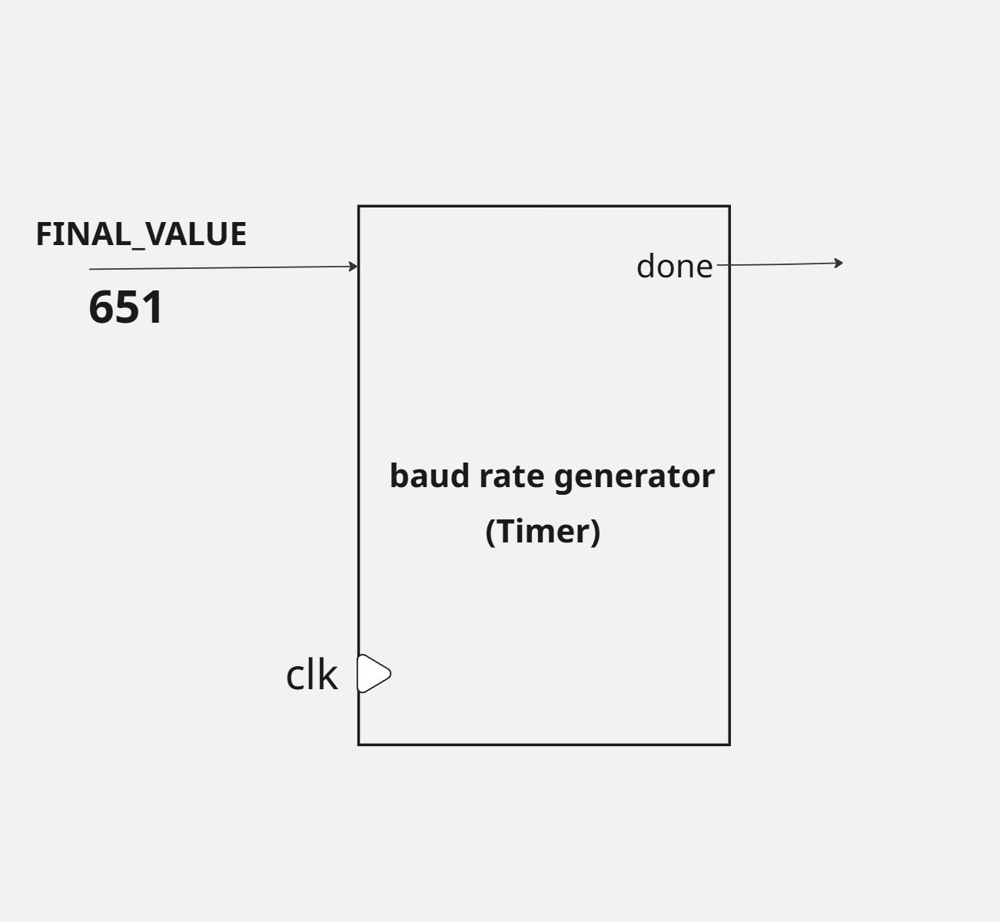
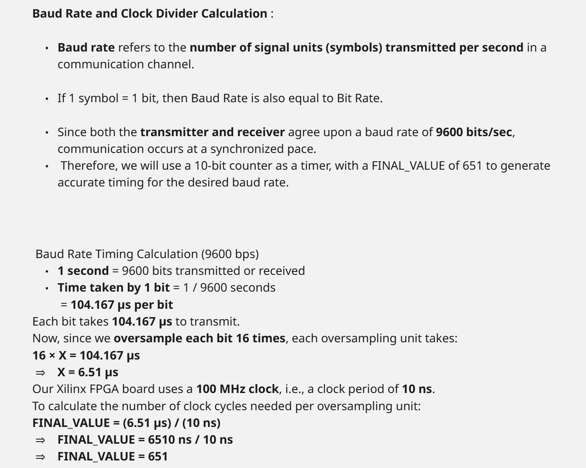
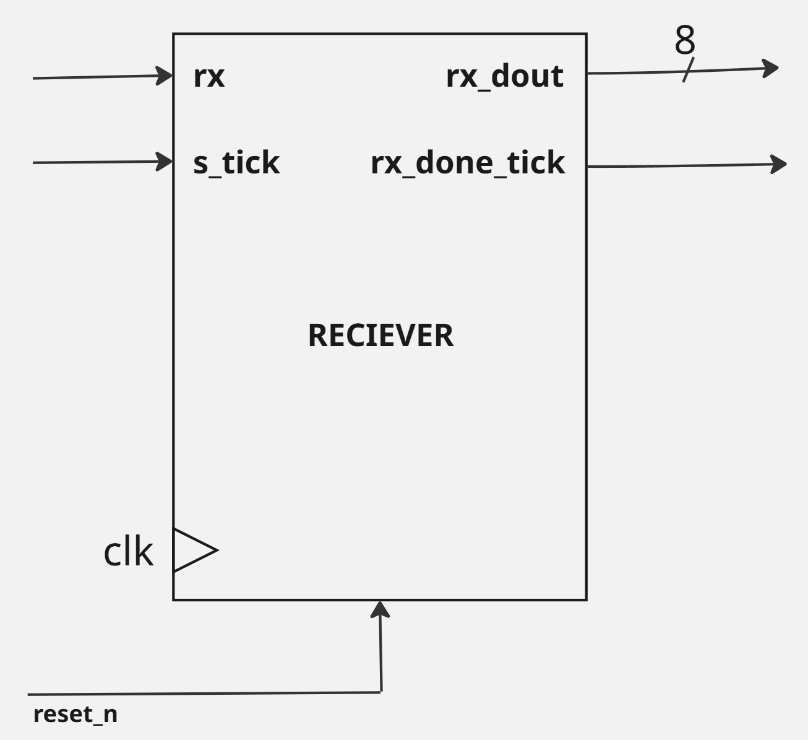
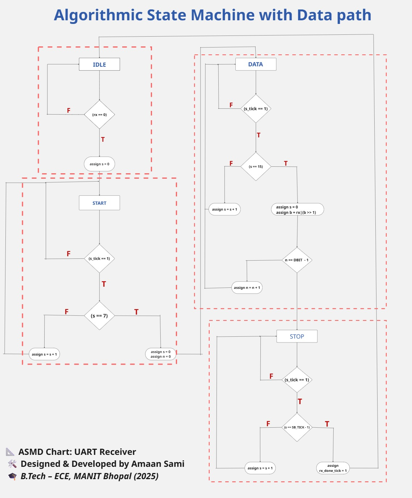
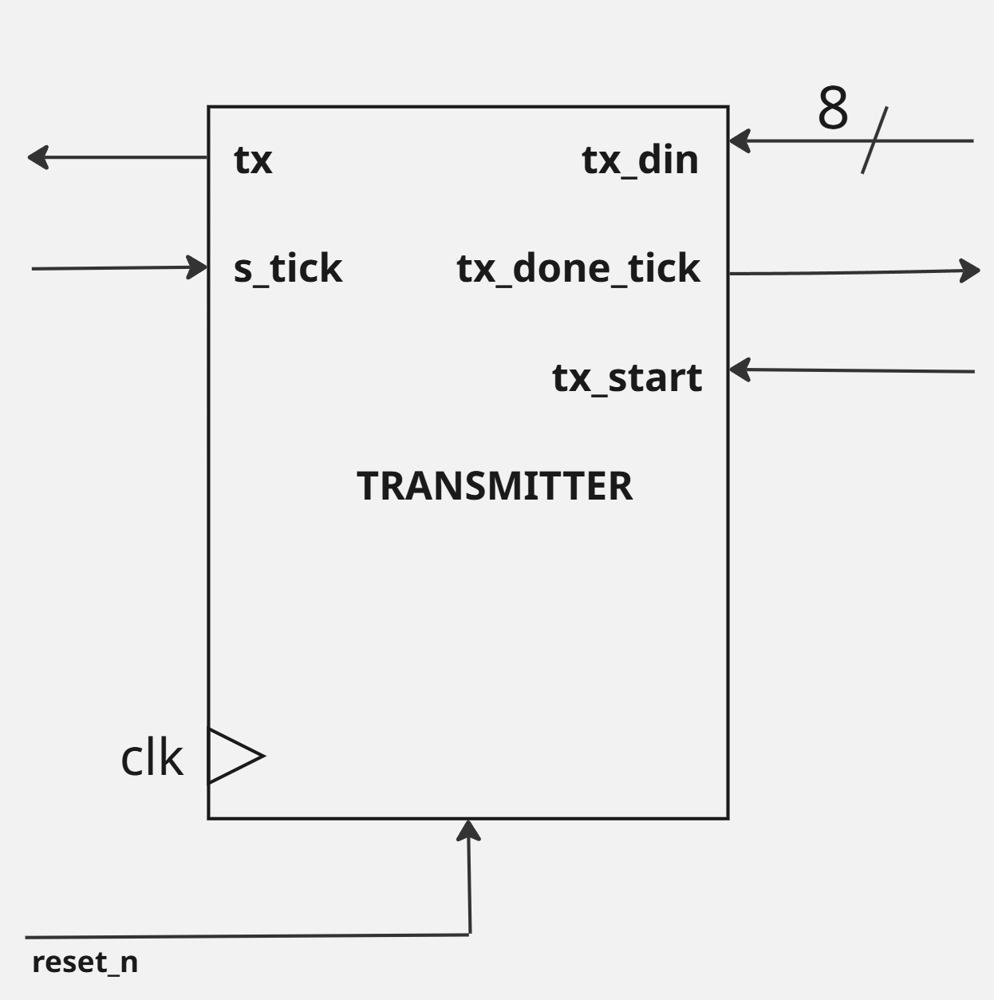
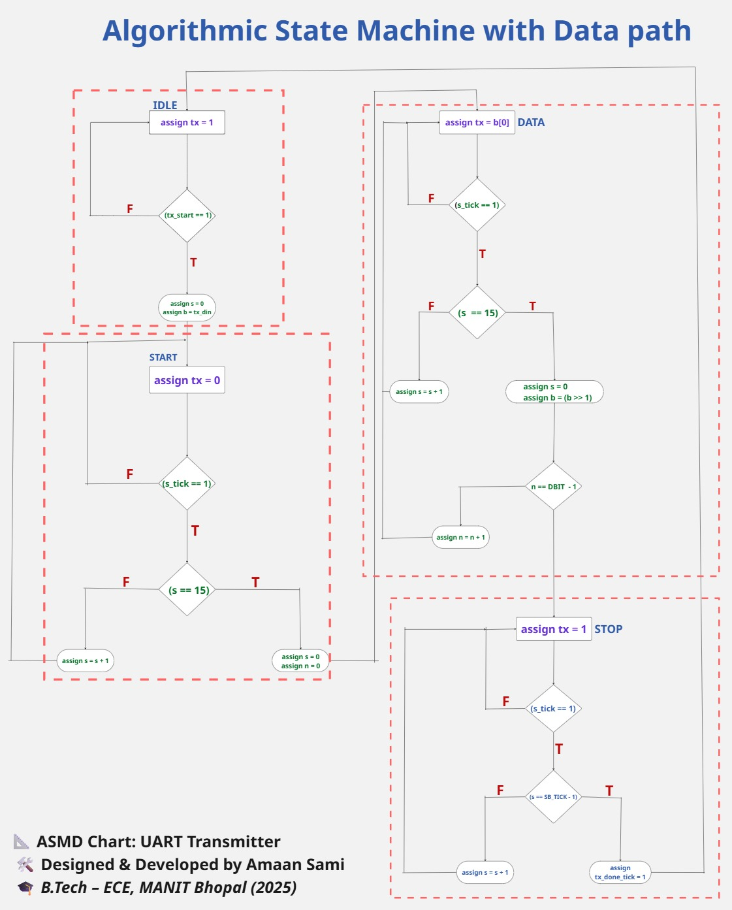
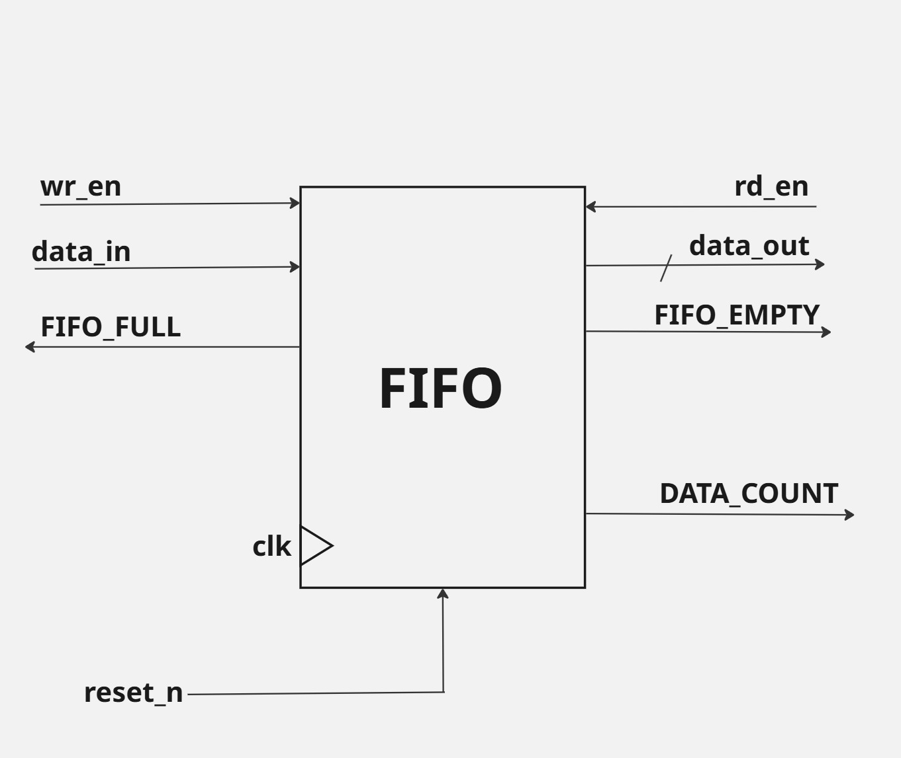
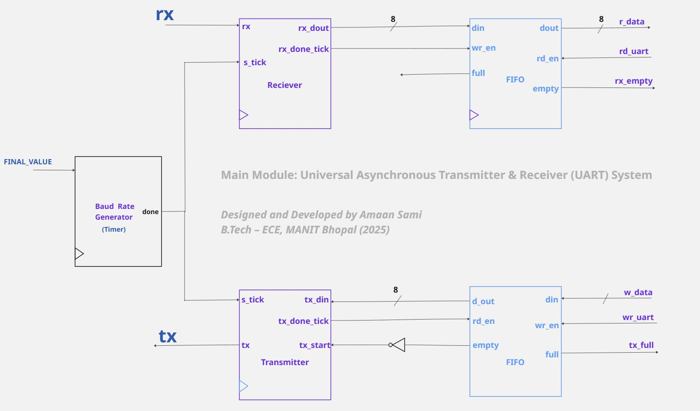

# 📡 Universal Asynchronous Transmitter Receiver (UART) Full System  
**Designed & Developed by Amaan Sami**  
_B.Tech – Electronics and Communication Engineering (2025)_  
_MANIT Bhopal_

---

## 📦 Project Summary

This project implements a full UART communication system designed using Verilog HDL.  
It includes:
- Baud Rate Generator  
- UART Receiver (FSM based)  
- UART Transmitter (FSM based)  
- FIFO Buffers (for RX and TX paths)  
- RAM Memory  
- Fully integrated final module  

Each module is described below with diagrams.

---

# 📘 Modules Overview

---

## 1️⃣ Baud Rate Generator

**Purpose:**  
Generates timing pulses (`tick`) for UART modules using a configurable `FINAL_VALUE`.

**Diagram:**  

**Description:**  
- Acts as a clock divider.  
- Produces periodic ticks for precise baud rate control.  
- Final value can be set for any required baud rate (e.g., 9600 bps).

**Baud Calculation:**  

---

## 2️⃣ UART Receiver

**Purpose:**  
Receives serial bits from `rx` line and reconstructs parallel data.

**Block Diagram:**  

**ASMD Chart:**  

**Description:**  
- Operates as FSM with Start, Data, and Stop states.  
- Shifts in serial bits (LSB first).  
- Generates `rx_done_tick` when data word is fully received.

---

## 3️⃣ UART Transmitter

**Purpose:**  
Serializes parallel data and transmits via `tx` line.

**Block Diagram:**  

**ASMD Chart:**  

**Description:**  
- Operates as FSM to send start bit, data bits (LSB first), and stop bit.  
- Sends data word upon detecting `tx_start`.  
- Assert `tx_done_tick` after transmission completion.

---

## 4️⃣ FIFO Buffers

**Purpose:**  
Buffers parallel data for RX and TX paths to handle data flow smoothly.

**Block Diagram:**  

**Description:**  
- Built using RAM and read/write pointer logic.  
- Handles data buffering to avoid overflow/underflow conditions.  
- Used separately for RX and TX channels.

---

## 5️⃣ Random Access Memory (RAM)

**Purpose:**  
Implements storage inside FIFO buffers.

**Description:**  
- Simple synchronous RAM module.  
- Supports parallel read/write operations.  
- Parameterized width and depth.

---

## 6️⃣ Final Integrated UART Module

**Purpose:**  
Combines all submodules (TX, RX, FIFOs, Baud Generator) for full UART communication.

**Diagram:**  

**Description:**  
- Handles both transmitting and receiving simultaneously.  
- FIFO-managed data buffers ensure proper data flow.  
- Can be connected in loopback for self-testing.

---

## 7️⃣ UART Testbench (Planned)

**Diagram (To be added):**  

**Description:**  
- Simulates full RX and TX operation.  
- Injects serial bits on `rx`.  
- Monitors transmitted serial data from `tx`.  
- Reads data from RX FIFO after reception.

> _**Note:** UART_tb.v and diagram will be uploaded soon._

---

### 📊 UART Data Flow

RX Path:
RX Line ──▶ Receiver (FSM) ──▶ RX FIFO ──▶ r_data

TX Path:
w_data ──▶ TX FIFO ──▶ Transmitter (FSM) ──▶ TX Line

Baud Rate Generator:
Controls timing ticks for both Receiver and Transmitter modules.

